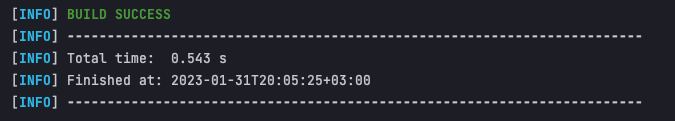

# assignment-two

Repository for DefineX Spring Practicum - Assignment 2

# Getting Started

The project is meant to mimic a part of some system that has users with the ability to create, save and retrieve their
invoices.

## How to run?

Steps to run from commandline (No IDE):

1. Download and install a JDK , with Java 8 or up.
2. Download and install Maven.
3. Clone the project:

With SSH:

```
git clone git@github.com:sanelg7/assignment-two.git
```

With HTTPS:

```
git clone https://github.com/sanelg7/assignment-two.git
```

4. From your terminal/cmd go to the projects folder. You should be **inside** "assignment-two".

5. Run:

```
> mvn package
```

You will get something like this if successful:


6. Run:

```
> java -jar target/assignment-two-1.0.jar
```

You just ran the program, congrats!

# Required Functionality and Constraints

Funcionalities:

- List all customers.
- Add a new customer.
- List customers based on their full name including a character or string.
- List all Invoices for customers who signed up on June.
- List all Invoices.
- List all Invoices according to their total price being greater or less than some value.
- List a set of Invoices and get their total price average.
- List all customer names for their Invoice total.
- List all sectors that have Vendors with a certain total price average for a month.

Constraints:

- Must be a Maven project.
- Can run inside main method.
- Must demonstrate basic Java concepts, and OOP principles.
- Must use Collections such as List, Set, Map...
- Filtering must be done via the Java Streams API.

## Some Notes About The Assignment

- The project is not designed to be a web project or include a database.

Main challenge is to find a way to create relations between classes without the use of a database.
It was achieved by passing objects as parameters to other object definitions. While it could be done,
I did not create intermediate classes for showing the relations.

Another was to make the project make sense. The goal is not to create a function rich application,
but still adding small details like a general User class is there, so that people can understand what the project
**would** look like if it were to be realized in a real environment. So it is not necessarily functional.

Tried to stick with Single Responsibility for methods and seen that I could eliminate entire service classes because of
it.
That is why I do not have a Vendor service for example. All functionality could be achieved without it.